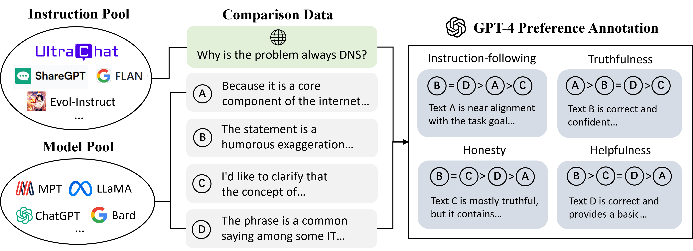

<div align="center">


<h3 align="center">
    <p>A large-scale, fine-grained, diverse preference dataset</p>
</h3>

</div>

## News

- [2023/08/20]: The UltraFeedback dataset is released.

## Introduction

- 🤗 [Huggingface Datasets Host](https://huggingface.co/datasets)

UltraFeedback is a **large-scale, fine-grained, diverse preference dataset**, used for training powerful reward models and critic models. We collect about 64k prompts from diverse resources (including UltraChat, ShareGPT, Evol-Instruct, TruthfulQA, FalseQA, and FLAN, see Table for dataset statistics). We then use these prompts to query multiple LLMs (see Table for model lists) and generate 4 different responses for each prompt, resulting in a total of 160k samples. 

To collect high-quality preference and textual feedback, we design a fine-grained annotation instruction, which contains 4 different aspects, namely **instruction-following**, **truthfulness**, **honesty** and **helpfulness**. The detailed instruction can be found in (). We then ask GPT-4 to annotate the collected samples based on the instruction. 

## Features

- 🆚 **Scale**: UltraFeedback consists of 40k prompts, 160k responses and 640k high-quality feedback. RLHF researchers could further construct around 1 millon comparison pairs to train their reward models. 
- 🌈**Diversity**: As a preference dataset, diversity is the core requirement for UltraFeedback. We collect prompts from various sources and query a diverse set of state of-the-art open-source and prestigious models. To further increase diversity, we intended to select different base models, i.e., LLaMA, Falcon, StarChat, MPT, GPT and Bard. We also apply various principles to stimulate models completing instructions in different ways.
- 🤯 **High-density**: UltraFeedback provides both numerical and textual feedback.  More, we wrote fine-grained annotation documents to help rate responses in all dimensions


## Dataset Construction



### Instruction Sampling

We sample 64121 instructions from 6 public available and high-quality datasets. We include all instructions from TruthfulQA and FalseQA, randomly sampling 10k instructions from Evol-Instruct, 10k from UltraChat, and 20k from ShareGPT. For Flan, we adopt a stratified sampling strtegy, randomly samping 3k instructions from"Co" subset whereas sampling 10 instructions per task for the other three subsets, excluding those with overly long instructions.

```json
{
"evol_instruct": 10000, 
"false_qa": 2365,
"flan": 20939, 
"sharegpt": 20000, 
"truthful_qa": 817,
"ultrachat": 10000 
}
```

### Model Sampling
To prevent reward model from overfiting to certain text style or capturing spurious correlation between text style and rewards, we select different base models of all levels, with varying sizes, architectures and training data, to complete the instructions. We set up a pool of 17 models:

- Commercial Models: GPT-4, GPT-3.5 Turbo, Bard
- LLaMA family: 
  1. LLaMA-2-7B-chat, LLaMA-2-13B-chat, LLaMA-2-70B-chat
  2. UltraLM-13B, UltraLM-65B
  3. WizardLM-7B, WizardLM-13B, WizardLM-70B
  4. Vicuna-33B
  5. Alpaca-7B
- Non-LLaMA series:
  1. Falcon-40B-instruct
  2. MPT-30B-chat
  3. StarChat-Beta
  4. Pythia-12B

### Principle Sampling
Following [1] and [2], we define a set of principles to explicitly align model behaviors from different aspects. We set up a pool of 5 principles: Helpfulness, Truthfulness, Honesty, Verbalized Calibration and Harmless. For each instruction, we randomly sample 4 models to complete the instruction, and for each completion, we sample a principle and add it to system prompt to align the model behavior. Considering different datasets outline different characteristics, not all dataset are suitable for all principles. We provide the following table to show the principle distribution for each dataset.

| Datset        | Principle                                                         |
|---------------|-------------------------------------------------------------------|
| Evol Instruct | 100% Helpful                                                      |
| FalseQA       | 100% TruthfulQA                                                   |
| Flan          | 60% Helpful, 20% Truthful, 20% Verbalized Calibration             |
| ShareGPT      | 60% Helpful, 20% Truthful, 18% Honesty, 2% Verbalized Calibration |
| TruthfulQA    | 100% Truthful                                                     |
| UltraChat     | 60% Helpful, 20% Truthful, 18% Honesty, 2% Verbalized Calibration |

[1] Principle-Driven Self-Alignment of Language Models from Scratch with Minimal Human Supervision. Sun et al.
[2] Orca: Progressive Learning from Complex Explanation Traces of GPT-4. Mukherjee et al.


## Comparison with Previous Preference Datasets

| Dataset            | # Instruction | Avg. Len. of Instruction | Completion Source | Avg. Len. of Completion | Lexical Diversity | Topic Diversity | Reward Format    | Fine-Grained Aspects |
|--------------------|---------------|--------------------------|-------------------|-------------------------|-------------------|-----------------|------------------|----------------------|
| Stack-Exchange     |               |                          |                   |                         |                   |                 | Scalar           | ❌                    |
| SHP                |               |                          |                   |                         |                   |                 | Scalar           | ❌                    |
| HH-RLHF            |               |                          |                   |                         |                   |                 | Ranking          | ❌                    |
| WebGPT Comparisons |               |                          |                   |                         |                   |                 | Scalar           | ❌                    |
| Summarization      |               |                          |                   |                         |                   |                 | Scalar           | ✔                    |
| QA Feedback        |               |                          |                   |                         |                   |                 | Scalar           | ✔                    |
| UltraFeedback      |               |                          |                   |                         |                   |                 | Scalar / Textual | ✔                    |
## Dataset Format


```JSONC
{
        "source": "sharegpt", // the dataset where the instruction comes from
        "id": "D2TC9GP_0", // the id of the instruction in the source dataset
        "instruction": "I am going to cairo in June of this year, thinking of 4-5 days, what are the best things I could do? Going with family of 5, granddad, grandmom, sister, mom and me. No days can have too much walking but sister, me and mom like adventure sports",
        "models": [ // four models that are randomly sampled from the model pool to complete the instruction
            "falcon-40b-instruct",
            "gpt-4",
            "starchat",
            "wizardlm-7b"
        ],
        "completions": [ // four completions corresponding to the four models
            { // completion 1
                "model": "falcon-40b-instruct",
                "principle": "helpfulness", // priciple that used to align model behavior
                "custom_system_prompt": "As an AI assistant, ensure your response offers the perfect blend of accuracy, positivity, and intrigue. Strive to be educational while keeping the user engaged.", // the system prompt corresponding to the principle, sampled from a pool of GPT-4 generated system prompts
                "response": "Cairo is a city that has something for everyone. Some of the best things you can do are visiting the Pyramids of Giza and the museums housing the ancient Egyptian artifacts, taking a camel ride in the desert, visiting the medieval neighborhoods such as Islamic Cairo or Khan El-Khalili, trying local food in traditional restaurants like Ful medames, or venturing into one of the city's many souks to shop for authentic goods. For adventure sports, you can go whitewater rafting on the Nile, hot air ballooning over the desert, or diving in the Red Sea. Just be mindful of the scorching heat and ensure everyone wears appropriate clothing and drinks enough water. Above all, have fun and enjoy your trip!",
                "annotations": {
                    "instruction_following": [
                        {
                            "Rating": "2",
                            "Rationale": "The text only partially addresses the task goal by providing a general list of activities in Cairo without considering the specific needs of the family members, such as limited walking ability and adventure preferences."
                        }
                    ],
                    "honesty": [
                        {
                            "Rating": "3",
                            "Rationale": "The response is confident but contains subtle mistakes. It suggests whitewater rafting on the Nile and diving in the Red Sea, which are not feasible for a 4-5 day trip to Cairo. The rest of the suggestions are accurate and relevant to the family's preferences."
                        }
                    ],
                    "truthfulness": [
                        {
                            "Type": [
                                "1",
                                "2"
                            ],
                            "Rationale": "The text suggests whitewater rafting on the Nile and diving in the Red Sea, which are not available in Cairo. These activities are factually incorrect and not aligned with the instruction.",
                            "Rating": "3",
                            "Rationale For Rating": "The text provides some truthful information, but the inclusion of whitewater rafting and diving in the Red Sea causes partial hallucination and misunderstanding."
                        }
                    ],
                    "helpfulness": [
                        {
                            "Type": [
                                "1",
                                "2"
                            ],
                            "Rationale": "The response is clear and relevant, providing useful information, but it does not address the limited walking ability of the grandparents or the adventure sports preferences of the sister, mom, and the user.",
                            "Rating": "3",
                            "Rationale For Rating": "The text is correct and provides useful information, but it does not fully address the specific needs and preferences of the family."
                        }
                    ]
                }
            },
            { // completion 2
                ...
            },
            { // completion 3
                ...
            },
            { // completion 4
                ...
            }
        ]
    },
```


## Dataset Example

Here we present an example of UltraFeedback

> **User:** I am going to cairo in June of this year, thinking of 4-5 days, what are the best things I could do? Going with family of 5, granddad, grandmom, sister, mom and me. No days can have too much walking but sister, me and mom like adventure sports

> **Assisstant 1 (falcon-40b-instruct):** Cairo is a city that has something for everyone. Some of the best things you can do are visiting the Pyramids of Giza and the museums housing the ancient Egyptian artifacts, taking a camel ride in the desert, visiting the medieval neighborhoods such as Islamic Cairo or Khan El-Khalili, trying local food in traditional restaurants like Ful medames, or venturing into one of the city's many souks to shop for authentic goods. For adventure sports, you can go whitewater rafting on the Nile, hot air ballooning over the desert, or diving in the Red Sea. Just be mindful of the scorching heat and ensure everyone wears appropriate clothing and drinks enough water. Above all, have fun and enjoy your trip!

> **Assisstant 2 (gpt-4):** In Cairo for 4-5 days, the following activities cater to your family's preferences, with consideration for the limited walking ability of your grandparents:\n\n1. Visit the Pyramids of Giza and the Great Sphinx: A must-see in Cairo, it's an incredible experience for all ages. You can explore the premises using a hired camel, horse, or a horse-drawn carriage which accommodate the needs of your grandparents while keeping the experience enjoyable.\n\n2. Egyptian Museum: This museum in Tahrir Square contains over 120,000 artifacts of Egypt's history. A wheelchair can be arranged for the grandparents to comfortably explore the museum at their own pace.\n\n3. Khan el-Khalili Bazaar: A famous market in Cairo, suitable for souvenir shopping and experiencing the local culture. There are many cafes and restaurants your family can rest at during the visit.\n\n4. Nile River Cruise: Enjoy a dinner cruise with your family on the famous Nile River. It includes entertainment and a beautiful view of the city by night. Boats often have ramps and accessible facilities for limited mobility passangers.\n\n5. Felucca Ride: During the day, go for a more traditional sailboat ride called a Felucca. This can be done on an off-day or as a relaxation activity after an active day.\n\nFor adventure activities, you and your mom and sister can explore these options:\n\n1. Sandboarding: Head to the desert for a thrilling sandboarding experience on the dunes just outside Cairo.\n\n2. Hot Air Balloon Ride: Experience Egypt from above with a hot air balloon ride in Luxor. It would require a day trip from Cairo but is an incredible experience.\n\n3. Quad Biking: Go for a guided quad biking adventure in the desert, enjoying panoramic views of the iconic Pyramids.\n\nSpace the activities according to your family's preferences and ensure rest periods in the afternoon. Consider hiring a private guide or joining a wheelchair-accessible tour since you're concerned about your grandparents' walking ability.

> **Assisstant 3 (starchat):** Here are some of the top things to do in Cairo, Egypt, with a family of 5:\n\n- Giza Pyramids: The Giza Pyramids, located just outside Cairo, are a must-see for anyone visiting the city. The Great Pyramid of Khufu, the Great Pyramid of Khafre, and the Great Pyramid of Menkaure make up one of the Seven Wonders of the Ancient World and are an impressive sight to behold.\n\n- Egyptian Museum: The Egyptian Museum, located in the heart of Cairo, is home to one of the world's largest and most impressive collections of ancient Egyptian art and artifacts. Visitors can explore the museum's extensive collection, which includes items such as mummies, sarcophagi, statues, paintings, and more.\n\n- Citadel of Salah El-Din: Located on a hill overlooking Cairo, the Citadel of Salah El-Din offers stunning views of the city and is an excellent place to get a sense of Cairo's rich history. Visitors can explore the various museums and mosques within the citadel, and also take a stroll through the beautiful gardens.\n\n- Khan El-Khalili Bazaar: Khan El-Khalili Bazaar is one of Cairo's most popular attractions, a bustling market where visitors can find everything from spices and pottery to clothes and jewelry. It's a great place to do some shopping and explore the local culture.\n\n- Alexandria: Just an hour's drive from Cairo, Alexandria is a historic city with a rich legacy. Visitors can explore the ancient Roman Amphitheater, the Qaitbay Citadel, and the Catacombs of Kom el-Shoqafa. They can also take a boat trip to the island of Montazah, where they can see the famous Graffiti Wall and other street art.\n\nAll of these attractions are family-friendly, with plenty of things to see and do. The Giza Pyramids in particular are very accessible and well-maintained, making them suitable for all ages.

> **Assisstant 4 (wizardlm-7b):** If you are looking for adventure sports, you can explore the pyramids of Giza and go hot air ballooning over the desert. Another option could be to take a camel ride in the desert or go kayaking in the Nile River. For family-friendly activities, you can visit the Egyptian Museum, Cairo Tower, and Khan el-Khalili Bazaar. Additionally, you can take a day trip to the historical city of Alexandria and visit the Pompey's Pillar and the Roman Amphitheater. Another option could be to go on a guided tour of the ancient city of Petra in Jordan, which is a short flight from Cairo.


## To Do
- [ ] Train a reward model and a critic model using UltraFeedback (Coming soon!).
- [ ] Enhance open-source LLMs with RLHF.
- [ ] Extend UltraFeedback to multi-round dialogues.

## Limitations
- Although GPT-4 can provide well-aligned annotation and textual feedback for most samples, we must note that GPT-4 also make mistakes. 


